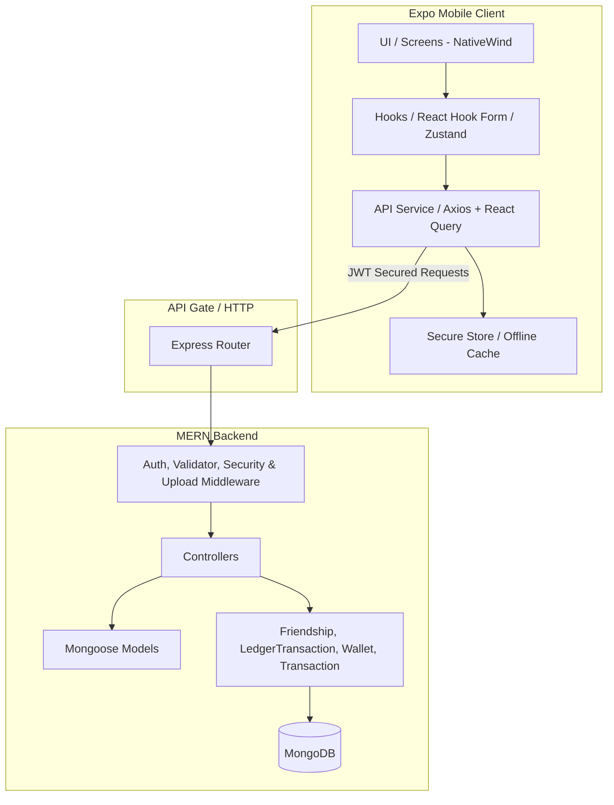

# Project Specification: Personal Finance Tracker (Expo + MERN Stack)

This document provides a comprehensive and production-ready project specification for the **Personal Finance Tracker** application, based on the outlines in [plan.txt](file:///Users/maegbug/ai_project/personal_finance_tracker/plan.txt). The application comprises an **Expo React Native** mobile client and a **Node.js/Express/MongoDB (MERN)** backend services architecture.

---

## 1. Architectural Overview

The application follows a **Clean Architecture** paradigm to decouple business logic from framework concerns, ensuring testability, maintainability, and horizontal scalability.

### Key Architectural Patterns
* **State & Query Management**: Zustand manages user authentication and profile state. Core components leverage Axios API wrappers for CRUD interactions.
* **Navigation Flow**: Expo Router drives the application layout using file-based routing. Includes a floating layout bar for major tabs and modal routing for add/edit controllers.
* **Validation & Security Layers**: Validation is handled via express routes schemas on the backend and strict form validators on the mobile client.

---

## 2. Technology Stack

### Mobile Client
* **Framework**: [Expo SDK](https://expo.dev/) (latest) & React Native.
* **Navigation**: Expo Router (floating tab bar navigation supporting index, wallets, friends, and profile screens).
* **Styling**: Vanilla React Native stylesheet elements with premium color palettes, rounded custom borders, and smooth UI flow.
* **Icons**: `@expo/vector-icons` FontAwesome package.
* **Network & State**: Axios instances for api calls and Zustand store slices.
* **Popups & Dialogs**: `CustomAlert` components containing overlay success, warning, confirmation, and danger alerts.

### Backend Services
* **Runtime & Framework**: Node.js & Express.js.
* **Database**: MongoDB & Mongoose ORM.
* **Security & Utility**:
  * JWT (Authentication tokens).
  * Bcrypt (Salted password hashing).
  * Helmet (HTTP headers protection).
  * CORS & Express Rate Limiter.

---

## 3. Database Schema Design (MongoDB & Mongoose)

All schemas store `createdAt` and `updatedAt` timestamps.

### 3.1 Users Collection (`users`)
Stores profile information, security credentials, preferences, and notification triggers.
* `_id`: ObjectId
* `name`: String (Required, trimmed)
* `email`: String (Required, unique, indexed, lowercase)
* `password`: String (Required, hashed via bcrypt)
* `currency`: String (Default: 'USD', e.g., 'USD', 'EUR', 'MMK', 'SGD', 'THB', 'JPY')
* `monthlySalary`: Number (Default: 0)
* `notificationSalary`: Boolean (Default: true)
* `notificationExpenseLimit`: Boolean (Default: true)
* `notificationMonthlyFee`: Boolean (Default: true)
* `theme`: String ('light' | 'dark' | 'system')

### 3.2 Wallets Collection (`wallets`)
Provides multi-source financial support.
* `_id`: ObjectId
* `userId`: ObjectId (Ref: `users`, Indexed)
* `name`: String (e.g., "KBZ Pay", "Wave Pay", "CB Bank", "Cash")
* `balance`: Number (Default: 0)
* `currency`: String (Default: 'USD')
* `color`: String (HEX code color code for UI cards)
* `icon`: String (Material Icons token name)
* `type`: String ('cash' | 'bank' | 'mobile_wallet' | 'other')

### 3.3 Categories Collection (`categories`)
* `_id`: ObjectId
* `userId`: ObjectId (Ref: `users`, Nullable for system-wide defaults, Indexed)
* `name`: String (Required)
* `type`: String ('income' | 'expense')
* `color`: String (HEX format)
* `emoji`: String (Emoji Unicode character)

### 3.4 Transactions Collection (`transactions`)
* `_id`: ObjectId
* `userId`: ObjectId (Ref: `users`, Indexed)
* `walletId`: ObjectId (Ref: `wallets`, Indexed)
* `categoryId`: ObjectId (Ref: `categories`, Indexed)
* `type`: String ('income' | 'expense' | 'transfer')
* `amount`: Number (Required)
* `date`: Date (Default: now, Indexed)
* `description`: String
* `destinationWalletId`: ObjectId (Ref: `wallets`, Nullable - populated only for 'transfer' type)

### 3.5 Friendships Collection (`friendships`)
Stores bidirectional user link requests.
* `_id`: ObjectId
* `requester`: ObjectId (Ref: `users`, Indexed)
* `recipient`: ObjectId (Ref: `users`, Indexed)
* `status`: String ('pending' | 'accepted' | 'rejected')

### 3.6 LedgerTransactions Collection (`ledgertransactions`)
Stores balance debts and payment splits.
* `_id`: ObjectId
* `description`: String (Required)
* `amount`: Number (Required)
* `paidBy`: ObjectId (Ref: `users`, Indexed)
* `owedBy`: ObjectId (Ref: `users`, Indexed)
* `settled`: Boolean (Default: false)

---

## 4. Key Functional Features & Specifications

### 4.1 Onboarding & Splash
* Premium entry animations displaying currency defaults, custom logo, and clean landing actions.

### 4.2 Auto-Recurring setups
* Configuration inside settings screen supporting custom next run due date string entries in `YYYY-MM-DD` format. 
* Periodically creates matching wallet transactions, calculates salary income notifications, monthly fee reports, and updates balances.

### 4.3 Wallets & Categories CRUD
* System defaults are protected from modification.
* Custom entries allow personalized emojis, name strings, and color themes.
* Wallets display monthly performance grids summing incomes (+) and expenses (-) per wallet.

### 4.4 Friends list & Splitwise shared ledger
* **Friends Overview Tab**: Contains outgoing requests, incoming requests, acceptance switches, and net owes/you owe balance aggregates.
* **Shared Ledger Splits**: Add custom shared expense splits. Ledger displays timeline statements, who paid, and who owes.
* **Split with Friend toggle**: Built into the standard transaction creation form. Users can relate standard expenses/incomes to a friend, select split types, customize amounts (defaults to 50%), and create matching ledger records automatically.
* **Settle Up Form**: Settle full balances or make custom partial payments. Includes an option to sync the payment to your own wallet (creates an income or expense transaction in the selected wallet).

---

## 5. Security Enforcement Matrix

| Vector | Client Strategy | Backend Strategy |
| :--- | :--- | :--- |
| **Data in Transit** | Axios defaults to HTTP/HTTPS. | Strict CORS configurations. |
| **Credentials Storage** | JWT saved in client Zustand store. | Hashing via bcrypt (rounds: 12). |
| **Input validation** | Input formatting controls, date format filters. | Mongoose strict schemes. |
